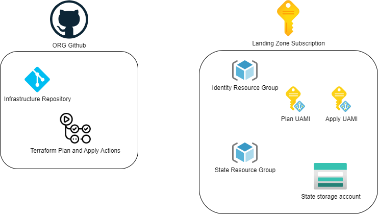

# Landing Zone Bootstrap

This repository is meant to bootstrap infrastructure repository with terraform CI/CD and Azure Subscription.
Goal is to simplify and speed up deployment using best practices.

# Overview

Below is an overview of the module infrastructure:



# Support Status

| Version Control | Support |
|-----------------|---------|
| GitHub | Yes |
| Azure DevOps | Planned |  
| Gitlab | Planned |

| Self-hosted Runner | Support |
|-----------------|---------|
| GitHub | Planned |
| Azure DevOps | Planned | 
| Gitlab  | Planned | 

# Getting Started

Configure `landing_zone.auto.tfvars`:

```hcl
service_name                            = "application"
environment_name                        = "dev"
location                                = "francecentral"
github_personal_access_token            = "secret_password"
github_organization_name                = "my-org"
github_approvers                        = ["my@email.com"]
github_private_repository               = true
landing_zone_subscription_id            = "00000000-0000-0000-0000-000000000000"
enable_telemetry                        = false
github_root_module_folder_relative_path = "environments/dev"
```

Update `landing_zone.auto.tfvars` file, and run:

```sh
terraform init
terraform apply
``` 

<!-- BEGIN_TF_DOCS -->
## Requirements

| Name | Version |
|------|---------|
| <a name="requirement_terraform"></a> [terraform](#requirement\_terraform) | ~>1.10 |
| <a name="requirement_azurerm"></a> [azurerm](#requirement\_azurerm) | ~>4.18 |
| <a name="requirement_github"></a> [github](#requirement\_github) | ~> 5.36 |
| <a name="requirement_random"></a> [random](#requirement\_random) | ~> 3.6 |

## Providers

| Name | Version |
|------|---------|
| <a name="provider_azurerm"></a> [azurerm](#provider\_azurerm) | 4.20.0 |
| <a name="provider_random"></a> [random](#provider\_random) | 3.6.3 |

## Modules

| Name | Source | Version |
|------|--------|---------|
| <a name="module_azure"></a> [azure](#module\_azure) | ./modules/azure | n/a |
| <a name="module_github"></a> [github](#module\_github) | ./modules/github | n/a |
| <a name="module_resource_names"></a> [resource\_names](#module\_resource\_names) | ./modules/resource_names | n/a |

## Resources

| Name | Type |
|------|------|
| [random_string.this](https://registry.terraform.io/providers/hashicorp/random/latest/docs/resources/string) | resource |
| [azurerm_client_config.current](https://registry.terraform.io/providers/hashicorp/azurerm/latest/docs/data-sources/client_config) | data source |

## Inputs

| Name | Description | Type | Default | Required |
|------|-------------|------|---------|:--------:|
| <a name="input_enable_telemetry"></a> [enable\_telemetry](#input\_enable\_telemetry) | Enable telemetry. | `bool` | `true` | no |
| <a name="input_environment_name"></a> [environment\_name](#input\_environment\_name) | The name of the environment. | `string` | n/a | yes |
| <a name="input_github_approvers"></a> [github\_approvers](#input\_github\_approvers) | The list of GitHub users or teams that can approve the apply workflow. | `list(string)` | `[]` | no |
| <a name="input_github_organization_name"></a> [github\_organization\_name](#input\_github\_organization\_name) | The name of your GitHub organization. This is the section of the url after 'github.com'. E.g. enter 'my-org' for 'https://github.com/my-org' | `string` | `""` | no |
| <a name="input_github_personal_access_token"></a> [github\_personal\_access\_token](#input\_github\_personal\_access\_token) | The personal access token for GitHub. | `string` | `""` | no |
| <a name="input_github_private_repository"></a> [github\_private\_repository](#input\_github\_private\_repository) | Set GitHub private repository. When using a free plan, public repositories are required to get all the deployment features such as deployment protection rules and environments. | `bool` | `true` | no |
| <a name="input_github_repository_exists"></a> [github\_repository\_exists](#input\_github\_repository\_exists) | Set to true if the repository already exists. | `bool` | `false` | no |
| <a name="input_github_require_signed_commits"></a> [github\_require\_signed\_commits](#input\_github\_require\_signed\_commits) | Enforce signed commits for security | `bool` | `true` | no |
| <a name="input_github_root_module_folder_relative_path"></a> [github\_root\_module\_folder\_relative\_path](#input\_github\_root\_module\_folder\_relative\_path) | Set root module folder | `string` | `"."` | no |
| <a name="input_landing_zone_subscription_id"></a> [landing\_zone\_subscription\_id](#input\_landing\_zone\_subscription\_id) | The subscription id of the landing zone. | `string` | `""` | no |
| <a name="input_location"></a> [location](#input\_location) | The location/region where the resources will be created. | `string` | n/a | yes |
| <a name="input_postfix_number"></a> [postfix\_number](#input\_postfix\_number) | Used to build up the default resource names (e.g. rg-terraform-dev-francecentral-<postfix\_number>) | `number` | `1` | no |
| <a name="input_resource_names"></a> [resource\_names](#input\_resource\_names) | Override the default names for resources. | `map(string)` | <pre>{<br/>  "identity_apply_name": "id-{{service_name}}-{{environment_name}}-apply-{{azure_location}}-{{postfix_number}}",<br/>  "identity_plan_name": "id-{{service_name}}-{{environment_name}}-plan-{{azure_location}}-{{postfix_number}}",<br/>  "resource_group_identity_name": "rg-{{service_name}}-{{environment_name}}-identity-{{azure_location}}-{{postfix_number}}",<br/>  "resource_group_state_name": "rg-{{service_name}}-{{environment_name}}-state-{{azure_location}}-{{postfix_number}}",<br/>  "storage_account_state_name": "sto{{service_name}}{{environment_name}}state{{azure_location_short}}{{postfix_number}}{{random_string}}",<br/>  "user_assigned_managed_identity_federated_credentials_prefix": "{{service_name}}-{{environment_name}}-{{azure_location}}-{{postfix_number}}",<br/>  "version_control_system_environment_apply": "{{service_name}}-{{environment_name}}-apply",<br/>  "version_control_system_environment_plan": "{{service_name}}-{{environment_name}}-plan",<br/>  "version_control_system_repository_infra": "{{service_name}}-infra",<br/>  "version_control_system_repository_templates": "{{service_name}}-{{environment_name}}-templates",<br/>  "version_control_system_team": "{{service_name}}-{{environment_name}}-approvers"<br/>}</pre> | no |
| <a name="input_service_name"></a> [service\_name](#input\_service\_name) | The name of the landing zone service. | `string` | n/a | yes |
| <a name="input_version_control_server"></a> [version\_control\_server](#input\_version\_control\_server) | The version control system server. | `string` | `"github"` | no |

## Outputs

No outputs.
<!-- END_TF_DOCS -->